# NEXORA — SYSTEM ARCHITECTURE & ENTERPRISE DEPLOYMENT MANUAL

## 1. System Overview

**Nexora** is an Autonomous Industrial Safety Intelligence Platform designed to predict, explain, and mitigate non-linear compound hazards in oil & gas refineries, chemical synthesis plants, and power generation facilities.

---

## 2. Multi-Layer Enterprise Architecture Topology

```mermaid
graph TB
    %% LAYER 1: INDUSTRIAL EDGE INGESTION
    subgraph LAYER_1 ["🌐 LAYER 1: INDUSTRIAL EDGE & SENSOR INGESTION LAYER"]
        direction LR
        S1["⛽ SCADA Gas Sensors<br/>(LEL Analyser G-104 / G-105)"]
        S2["⚙️ Predictive Telemetry<br/>(AI4I Pump P-102 / RPM / Vibration)"]
        S3["🎥 CCTV Surveillance Grid<br/>(CAM-C01 to CAM-C06 + WebRTC Live Webcam)"]
        S4["📝 Work Permit System<br/>(PTW Hot Work Approvals)"]
        S5["📊 Industrial CSV Datasets<br/>(AI4I 2020 & Smoke/Fire IoT)"]
    end

    %% LAYER 2: ENTERPRISE API GATEWAY
    subgraph LAYER_2 ["⚡ LAYER 2: ENTERPRISE API GATEWAY & REAL-TIME WEBSOCKET STREAMER (FastAPI - Port 8000)"]
        direction TB
        GATEWAY["🛡️ OAuth2 / JWT Auth & RBAC Guard<br/>(Role-Based Access Control)"]
        RATELIMIT["⏱️ Rate Limiting Middleware<br/>(Token Bucket: 120 req/min)"]
        OBS["📊 Observability Probes<br/>(/healthz | /readyz | Prometheus /metrics)"]
        REST_API["🔌 v1 REST API Controller<br/>(/api/v1/machines, /risk, /copilot, /simulation)"]
        WS_STREAM["📡 Live WebSocket Telemetry Broadcaster<br/>(/ws/live @ 60 FPS Streamer)"]
    end

    %% LAYER 3: MULTI-AGENT SWARM
    subgraph LAYER_3 ["🧠 LAYER 3: MULTI-AGENT AI SWARM INTELLIGENCE LAYER (LangGraph + Gemini 2.0 Flash)"]
        direction TB
        SUPERVISOR["👑 SupervisorAgent<br/>(Swarm Orchestrator & Gemini 2.0 Flash XAI Synthesizer)"]
        
        subgraph AGENT_NODES ["Parallel Specialized Domain Agents"]
            AGENT_SENSOR["📡 SensorAgent<br/>(SCADA LEL Gas Accumulation)"]
            AGENT_MAINT["⚙️ MaintenanceAgent<br/>(AI4I Predictive Vibration/Wear)"]
            AGENT_PERMIT["📜 PermitAgent<br/>(Hot Work Spatial Proximity)"]
            AGENT_VISION["👁️ VisionAgent<br/>(YOLO v8 PPE & Zone Violation)"]
            AGENT_COMPLIANCE["⚖️ ComplianceAgent<br/>(Sentence-Transformers Vector RAG)"]
            AGENT_INCIDENT["🚨 IncidentAgent<br/>(Historical Precedent Matcher)"]
        end
    end

    %% LAYER 4: COMPOUND RISK & STORAGE
    subgraph LAYER_4 ["🧮 LAYER 4: NON-LINEAR COMPOUND RISK & VECTOR STORAGE LAYER"]
        direction LR
        RISK_ENGINE["🔥 Non-Linear Compound Risk Engine<br/>(Gamma Matrix γ = 3.5x Interaction Surge)"]
        RAG_ENGINE["📚 Sentence-Transformers Vector KB<br/>(OISD-105/116, OSHA 1910.119, ISO 45001)"]
        CHROMA_DB["🗄️ ChromaDB Vector Store<br/>(Embedding Search)"]
        REDIS_BUS["⚡ Redis Pub/Sub & Cache<br/>(Session & WebSocket Sync)"]
        POSTGRES["💾 SQLAlchemy 2.0 Async / PostgreSQL<br/>(Audit Ledger & State Tables)"]
    end

    %% LAYER 5: PRESENTATION LAYER
    subgraph LAYER_5 ["🖥️ LAYER 5: EXECUTIVE PRESENTATION & MISSION CONTROL LAYER (React 19 + Vite)"]
        direction LR
        DASHBOARD["📊 Executive Command Center<br/>(/dashboard - KPI Metrics & Alerts)"]
        TWIN["🗺️ Living P&ID Spatial Digital Twin<br/>(/digital-twin - SVG Animated Pipe Flows & Gas Clouds)"]
        VISION_UI["📹 Vision Intelligence Workspace<br/>(/vision - RTSP 6-Cam Grid & Live Webcam)"]
        XAI_UI["💡 4-Question XAI Diagnosis<br/>(Explainable AI & 1-Click Mitigation)"]
        AUDIT_UI["📜 Cryptographic Audit Ledger<br/>(/audit-ledger - SHA-256 Event Chain)"]
    end

    %% CONNECTIONS
    S1 & S2 & S3 & S4 & S5 --> GATEWAY
    GATEWAY --> RATELIMIT --> REST_API & WS_STREAM
    GATEWAY --> OBS

    REST_API --> SUPERVISOR
    SUPERVISOR --> AGENT_NODES

    AGENT_SENSOR & AGENT_MAINT & AGENT_PERMIT & AGENT_VISION & AGENT_COMPLIANCE & AGENT_INCIDENT --> RISK_ENGINE
    AGENT_COMPLIANCE --> RAG_ENGINE --> CHROMA_DB
    RISK_ENGINE --> SUPERVISOR

    SUPERVISOR --> POSTGRES
    WS_STREAM --> REDIS_BUS

    REST_API --> DASHBOARD & TWIN & VISION_UI & XAI_UI & AUDIT_UI
    WS_STREAM ==> TWIN & DASHBOARD
```



---

## 3. Core Subsystems

### 3.1 Non-Linear Compound Risk Engine
Calculates total compound risk $R_c$ using normalized base severities $r_i$, weights $w_i$, and cross-domain interaction multipliers $\gamma_{jk}$:

$$R_c = \min\left(99.9\%,\ \left[1 - \prod_{i=1}^{N} (1 - w_i r_i)\right] \times 80 + \sum_{j,k} \gamma_{jk} r_j r_k\right)$$

### 3.2 Multi-Agent Swarm (LangGraph & Gemini 2.0 Flash)
- **`SensorAgent`**: Evaluates SCADA atmospheric gas accumulation ($>20\%$ LEL).
- **`MaintenanceAgent`**: Analyzes AI4I machine telemetry (RPM, torque, tool wear, bearing vibration).
- **`PermitAgent`**: Evaluates spatial overlap between active PTWs and hazard boundaries.
- **`VisionAgent`**: Detects PPE non-compliance and un-cleared personnel in hazard zones.
- **`ComplianceAgent`**: Retrieves vector embeddings over OSHA 1910.119, OISD-105, OISD-116, ISO 45001.
- **`IncidentAgent`**: Matches live telemetry against historical incident database (Jamnagar 2021 VCE).
- **`SupervisorAgent`**: Synthesizes agent state into a **Gemini 2.0 Flash XAI 4-Question Diagnosis**.

---

## 4. Production Deployment Guide

### Single-Command Docker Deployment
```bash
docker-compose up -d --build
```
Access points:
- **Frontend Dashboard**: `http://localhost`
- **FastAPI REST API**: `http://localhost:8000`
- **OpenAPI Swagger Docs**: `http://localhost:8000/api/v1/docs`
- **Prometheus Metrics**: `http://localhost:8000/metrics`
- **Health Probes**: `http://localhost:8000/healthz`
